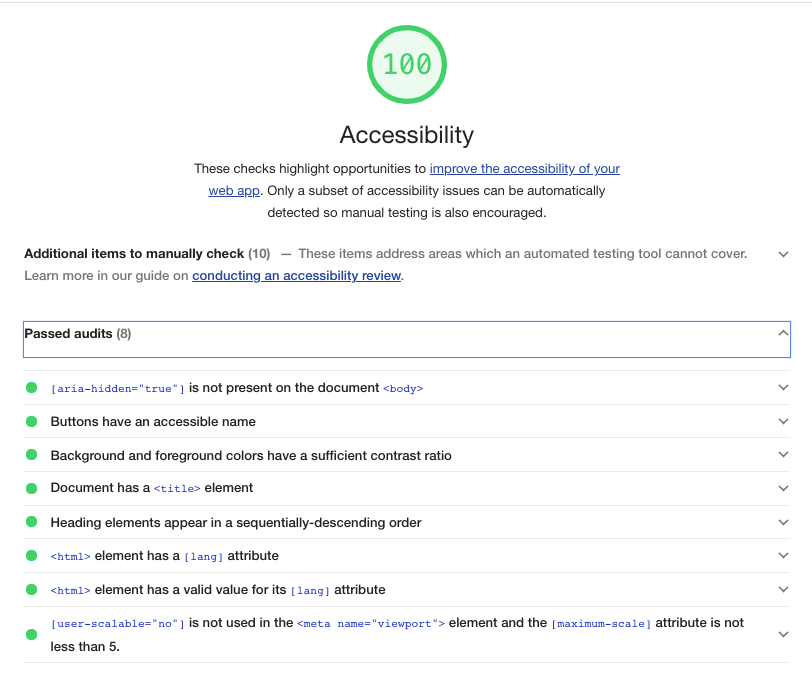

# Wave Front-end Challenge

## Documentation

This is a React App built on create-react-app.
### How to run this project:
1. To install, run `yarn install` from the root folder
2. `yarn start` to start the development server on `localhost:3000`
3. `yarn test` to run jest tests

### What I'm proud of:
- Added unit tests for the "happy path"
- The app and form are keyboard accessible. Each button and form field is tabbable, and even the select (up/down to change options). To be fair, the Grommet library did most of the work, but I did choose this framework with that in mind.
- Used semantic `<header>`, `<main>` and `<h*>` tags. Lighthouse is happy, the app passes the automatable audit checks.

- Came across and resolved a few interesting errors. [Jest giving a `"messageParent" can only be used inside a worker` error because the real error was being swallowed.](https://github.com/facebook/jest/issues/10577). And there seems to be an issue with the Grommet FormField validation, which would need to be fixed within the library itself. I just decided to use the default basic HTML required field validation instead.
